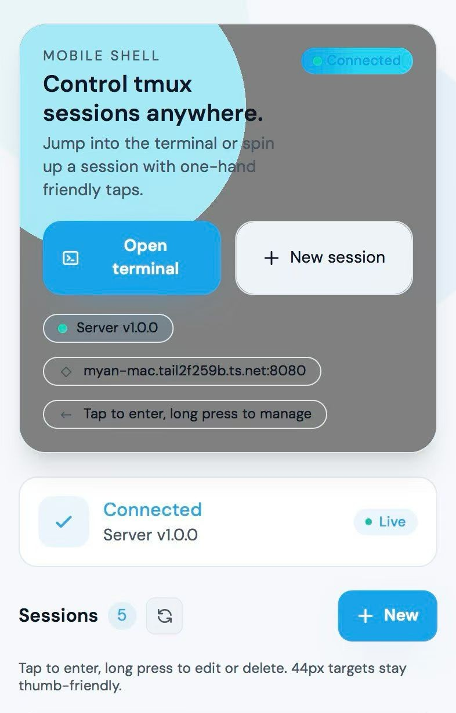
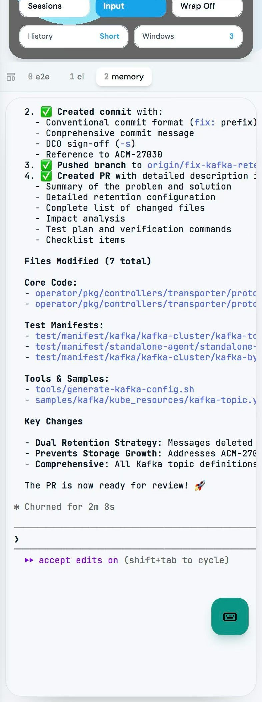

# HandX

> *Hand of Developer* — Inspired by "Hand of the King" from Game of Thrones

HandX lets you manage tmux sessions on your dev machine from anywhere. Run long tasks on your server, then open the web UI on your phone to check progress, send commands, or switch windows — all through a WebSocket connection.

<p align="center">
  
  &nbsp;&nbsp;
  
</p>
<p align="center">
  <em>Left: Live terminal &nbsp;|&nbsp; Right: Session list</em>
</p>

```
                                 ┌──────────────────────────┐
┌──────────────┐                 │  Dev Machine             │
│  Phone       │                 │                          │
│  - Browser   │◄── Tailscale ──▶│  Server (Go :8080)       │
└──────────────┘    WebSocket    │    └─ tmux manager       │
                                 │                          │
┌──────────────┐                 │  Web UI (Next.js :3000)  │
│  Desktop     │◄── localhost ──▶│    └─ terminal frontend  │
│  - Browser   │                 │                          │
└──────────────┘                 └──────────────────────────┘
```

## Project Structure

```
server/         Go WebSocket server — tmux session management, auth, QR code
web/            Next.js frontend — mobile-optimized terminal UI (PWA)
start.sh        One-command launcher for server + web
```

## Prerequisites

- **Go** 1.24+
- **Node.js** 18+ and npm
- **tmux** installed and available in PATH
- **Tailscale** (for remote access from phone)

## Quick Start

### 1. Start the server

```bash
./start.sh
```

This will:
- Build and start the Go WebSocket server on `:8080`
- Start the Next.js dev server on `:3000`
- Print a connection token and QR code in the terminal

Or start them separately:

```bash
# Terminal 1 — backend
cd server
go build -o bin/server ./cmd/server
./bin/server

# Terminal 2 — frontend
cd web
npm install
npm run dev
```

### 2. Open locally

```
http://localhost:3000
```

## Connect from Phone via Tailscale

[Tailscale](https://tailscale.com) creates a private mesh network between your devices — no port forwarding, no public exposure.

### Setup

1. Install Tailscale on your dev machine and phone
2. Sign in with the same account on both devices
3. Get your dev machine's Tailscale IP:
   ```bash
   tailscale ip -4
   ```

### Update server config

Edit `server/configs/config.yaml` to allow the Tailscale origin:

```yaml
cors:
  allowed_origins:
    - "http://localhost:3000"
    - "http://127.0.0.1:3000"
    - "http://<tailscale-ip>:3000"    # add this
```

### Bind web frontend to all interfaces

By default Next.js only listens on localhost. To expose it over Tailscale:

```bash
cd web
npx next dev -H 0.0.0.0
```

Or use `start.sh` — it already binds to `0.0.0.0`.

### Open on phone

In Safari or Chrome:

```
http://<tailscale-ip>:3000
```

Tap a session to connect, use the floating keyboard to type commands.

## Server Configuration

`server/configs/config.yaml`:

| Key | Default | Description |
|-----|---------|-------------|
| `server.port` | `8080` | WebSocket server port |
| `security.token_lifetime` | `1h` | Auth token expiry |
| `tmux.history_lines` | `10000` | Scrollback lines to capture |
| `cors.allowed_origins` | `localhost:3000` | Allowed CORS origins |
